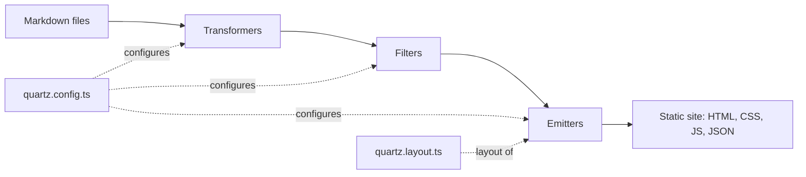

# Quartz: markdown folder to static wiki site

[Quartz](https://quartz.jzhao.xyz/) (v4) is a static site generator built for "digital gardens": you give it
a folder of markdown notes (typically an Obsidian vault or any wiki kept in git) and it produces plain
HTML, CSS and a little JavaScript. The result has full-text search, backlinks, a link graph, a file
explorer, tags, popover previews and dark mode, and can be served by any web server. There is no database,
no application server and no login: the site is a snapshot of the markdown at build time.

## How it works

Quartz is a Node.js program you run against a content directory. You keep three things: the content, a
`quartz.config.ts` and a `quartz.layout.ts`; the rest is upstream Quartz. A build runs every page through a
plugin pipeline:

- **Transformers** change each page: read frontmatter, compute created/modified dates, syntax-highlight code,
  handle Obsidian-flavoured markdown (callouts, wikilinks), GitHub-flavoured markdown, tables of contents,
  LaTeX and Mermaid, and resolve links between pages.
- **Filters** decide which pages are published (for example dropping pages marked `draft: true`).
- **Emitters** write the output: one HTML page per note, folder and tag index pages, the search index
  (`contentIndex.json`), a sitemap and RSS, static assets, the 404 page and favicon.
- **Configuration** is TypeScript: site title, base URL, theme, and the ordered plugin lists above.
  **Layout** decides which components (search, explorer, backlinks, graph, table of contents) appear where.
- **Command line:** `npx quartz build -d <content dir> -o <output dir>` builds any directory into any
  output directory, so content does not have to live inside the Quartz checkout. `--serve` starts a live
  preview for local writing.

Because the output is static, "publishing" means copying files to a web server; in a container setup that
usually means an nginx image rebuilt by CI on every push (see the
[hosting guide](../../../guides/administration/services/quartz-wiki-docker-ci-hosting.md)).

## When to use it / trade-offs

Use it when the source of truth is markdown in git and the site is a read-only view of it.

| | Quartz (static) | Database-backed wiki (e.g. Wiki.js) |
|---|---|---|
| Source of truth | Markdown files in git | Database (optionally mirrored to git) |
| Editing | In your editor or Obsidian, then commit | In the browser |
| Runtime | An nginx container; nothing to patch or back up beyond the repo | Application server plus database |
| Access control | None built in: protect at the reverse proxy or by network | Users, groups, page permissions |
| Freshness | Rebuilt by CI on each push (seconds to a minute) | Live |
| Attack surface | Static files | Application and login endpoints |
| Search, backlinks, graph | Built in, client-side | Depends on the product |

Good fit: a personal or team knowledge base kept in git and edited with tools (including LLM agents) that
work on files, a documentation site, a public digital garden, or a private site behind a VPN or reverse
proxy. Poor fit: many non-technical editors who need a browser editor and per-page permissions, or content
that must be visible the instant it is saved.

Two side effects worth knowing:

- Because the site is generated from files, **what you publish is decided by what you feed the build**. With
  a mixed private/public repository, publish by staging only the public folders as the build input and
  checking the result, not by hiding things afterwards (see the guard section of the hosting guide).
- Search and the graph run in the visitor's browser from a JSON index, so the site keeps working offline
  from a cache and needs no search backend.

## Pitfalls

- **Default config surprises.** The upstream `ignorePatterns` skips any directory named `private`; a content
  folder with that name silently vanishes from the site.
- **No home page, no `index.html`.** Quartz builds a home page from a root `index.md`. Without one, a web
  server image may show its own default page. Generate a root `index.md` if the content folder has none.
- **Dates need help in containers.** By default Quartz reads creation/modification dates from git; a Docker
  build context usually has no `.git`, so take them from frontmatter (or the filesystem).
- **Third-party calls.** The default fonts and social-image generation reach out to external services; switch
  them off for private or offline sites.
- **Duplicate titles.** Quartz renders the page title and the page's own top-level heading; use one of them.
- **Links to unpublished files are dead.** Relative links to content that is not part of the published folder
  render but do not resolve.
- **Upstream moves.** Config APIs change between releases. Pin a release tag and upgrade deliberately.
- **Docker in upstream is a dev server.** Quartz's own Docker image runs `quartz build --serve` for local
  previews only; for deployment build the static output and serve it with a normal web server.

## Related

- [Host a markdown wiki with Quartz in Docker, built by CI](../../../guides/administration/services/quartz-wiki-docker-ci-hosting.md) — step-by-step setup
- [Pulse self-hosted monitoring](pulse-monitoring.md) — another self-hosted service concept in this section

## Sources

- [Quartz documentation](https://quartz.jzhao.xyz/)
- [Quartz Docker support (upstream)](https://github.com/jackyzha0/quartz/blob/v4/docs/features/Docker%20Support.md)
- [Original notes: LAN-only site (private)](../../../../../sources/administration/services/2026-09-29-quartz-local-wiki-publishing.md)
