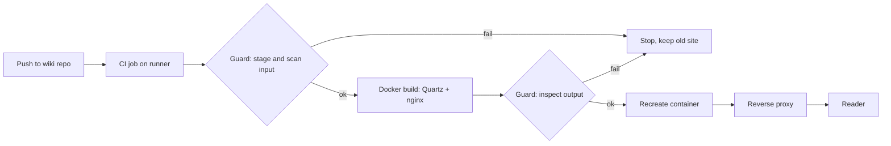

# Host a markdown wiki with Quartz in Docker, built by CI

[Quartz](https://quartz.jzhao.xyz/) (background: [what Quartz is and how it builds](../../../concepts/administration/services/quartz-static-wiki.md)) turns a folder of markdown files into a fast static website with
search, backlinks, a graph and an explorer. This guide shows a setup that needs **no second
repository and no vendored Quartz**: one Dockerfile in the wiki repo fetches a pinned Quartz release,
overlays your two config files, builds your markdown and serves the result with nginx. A CI job
rebuilds and redeploys it on every push. A last section shows how to publish **only a subset** of a
repository (for example a public folder inside a mixed private/public repo) in a way that fails
closed.



The two guard steps are optional for a wiki that is published completely; they matter when only part
of the repository may go public (see [Publishing only part of a repository](#publishing-only-part-of-a-repository)).

## Prerequisites

- A git repository with the markdown content (here: in a `wiki/` folder) and CI that can run Docker
  builds (Gitea Actions or GitHub Actions with the Docker socket available to the job).
- A Docker host running the site container, and a reverse proxy in front of it
  (Traefik labels are shown; anything that terminates TLS works).
- Outbound access from the build to GitHub and npm (Quartz is cloned and installed at build time).

## Steps

### 1. Repository layout

```
wiki/                      markdown content (the folder that gets published)
quartz/
  Dockerfile
  nginx.conf
  quartz.config.ts         copy of upstream's, edited (see step 4)
  quartz.layout.ts         copy of upstream's, optionally edited
  docker-compose.yaml      only if the CI runner and the site share a Docker host
.gitea/workflows/publish-quartz.yaml
.dockerignore              allowlist: wiki, quartz (keeps everything else out of the build context)
```

`.dockerignore` as an allowlist:

```
*
!wiki
!quartz
**/.git
```

### 2. Dockerfile: pinned Quartz, your config, your content

```dockerfile
# Upstream Quartz release fetched at build time. Bump to upgrade.
ARG QUARTZ_REF=v4.5.2

FROM node:22-slim AS build
ARG QUARTZ_REF
RUN apt-get update \
    && apt-get install -y --no-install-recommends git ca-certificates \
    && rm -rf /var/lib/apt/lists/*

WORKDIR /quartz
RUN git clone --depth 1 --branch "${QUARTZ_REF}" https://github.com/jackyzha0/quartz.git . \
    && npm ci

# Overlay our configuration onto the pristine upstream checkout.
COPY quartz/quartz.config.ts quartz/quartz.layout.ts ./

# Content changes most often, so it is copied last to keep the layers above cached.
COPY wiki/ /content/
# Quartz emits no index.html without a root index.md; generate a home page if the folder has none.
RUN [ -f /content/index.md ] || printf '%s\n' '---' 'title: My Wiki' '---' '' '# My Wiki' '' \
    '- [Section A](section-a/index.md)' > /content/index.md
RUN npx quartz build -d /content -o /out

FROM nginx:alpine
COPY quartz/nginx.conf /etc/nginx/conf.d/default.conf
# Remove nginx's default welcome page so it can never shadow a missing index.
RUN rm -rf /usr/share/nginx/html/*
COPY --from=build /out /usr/share/nginx/html
```

Why it is built this way:

- **Pinned tag** (`QUARTZ_REF`): upstream changes never break the build unnoticed; upgrading is a one-line change.
- **Overlay, not a fork**: only `quartz.config.ts` and `quartz.layout.ts` are yours. Upstream's own Docker
  support is a dev-server image ("for local previews only"), not a deployable site.
- **`-d /content -o /out`**: Quartz builds any directory, so the content does not have to live inside the
  Quartz checkout.
- **Layer order**: the expensive clone and `npm ci` layers stay cached; a content-only change rebuilds
  in seconds.

### 3. nginx.conf (clean URLs)

```nginx
server {
    listen 80;
    server_name _;
    server_tokens off;
    root /usr/share/nginx/html;
    index index.html;
    gzip on;
    gzip_types text/css application/javascript application/json image/svg+xml text/xml;
    error_page 404 /404.html;

    # Quartz emits clean URLs (/foo/bar -> foo/bar.html or foo/bar/index.html).
    location / {
        try_files $uri $uri.html $uri/ =404;
    }

    # Content changes constantly: never let browsers serve stale pages.
    add_header Cache-Control "no-cache";
    add_header X-Content-Type-Options "nosniff";
}
```

### 4. Quartz configuration

Start from upstream's `quartz.config.ts` for the pinned tag and change these settings:

```ts
configuration: {
  pageTitle: "My Wiki",
  analytics: null,                       // no third-party analytics
  baseUrl: "wiki.example.com",
  ignorePatterns: ["templates", ".obsidian"],
  theme: { fontOrigin: "local", cdnCaching: false, /* ... */ },
},
plugins: {
  transformers: [
    Plugin.FrontMatter(),
    // The build has no .git, so take dates from frontmatter, then the filesystem.
    Plugin.CreatedModifiedDate({ priority: ["frontmatter", "filesystem"] }),
    // ...
    // Relative markdown links with .md; also robust when many pages share a file name.
    Plugin.CrawlLinks({ markdownLinkResolution: "relative" }),
  ],
  emitters: [ /* upstream list, minus Plugin.CustomOgImages() */ ],
}
```

Pitfalls that cost time:

- Upstream's default `ignorePatterns` contains `"private"`. If your content folder has a directory with
  that name it silently disappears from the site. Set the list explicitly.
- `CreatedModifiedDate` defaults to git dates; the build context has no `.git`, so use frontmatter.
- `fontOrigin: "googleFonts"` and `CustomOgImages` fetch from Google at build or view time; drop them if
  the site must not call out to third parties.
- Mermaid code blocks (` ```mermaid `) render out of the box.

### 5. Container and reverse proxy

`quartz/docker-compose.yaml` (Traefik labels shown; the important part is the health check):

```yaml
services:
  wiki-quartz:
    image: <registry>/<owner>/wiki-quartz:latest
    container_name: wiki-quartz
    restart: unless-stopped
    healthcheck:
      test: ["CMD", "wget", "-q", "--spider", "http://127.0.0.1/"]
      interval: 60s
      start_period: 10s      # fast probing while starting ...
      start_interval: 2s     # ... so the proxy learns about the container in seconds
      timeout: 5s
      retries: 3
    labels:
      - "traefik.enable=true"
      - "traefik.http.routers.wikiquartz.rule=Host(`wiki.example.com`)"
      - "traefik.http.routers.wikiquartz.entrypoints=web, websecure"
      - "traefik.http.routers.wikiquartz.tls=true"
      - "traefik.http.routers.wikiquartz.tls.certresolver=<resolver>"
      - "traefik.http.services.wikiquartz.loadbalancer.server.port=80"
    networks:
      proxy-network:

networks:
  proxy-network:
    external: true
```

Traefik does not route to a container whose health is still `starting`. Without `start_interval` every
redeploy answered `404` for a full `interval` (about a minute).

### 6. CI workflow

Two deployment shapes; pick one.

**A. Runner and site on different hosts**: push the image to a registry, then tell the site host to pull
it (for example Watchtower's HTTP API with an image filter, so only this container is updated):

```yaml
name: publish-quartz
on:
  push:
    branches: [main]
    paths: ["wiki/**", "quartz/**", ".dockerignore", ".gitea/workflows/publish-quartz.yaml"]
  workflow_dispatch:

# The wiki changes constantly: only the newest state is worth building.
concurrency:
  group: publish-quartz
  cancel-in-progress: true

env:
  IMAGE: <registry>/<owner>/wiki-quartz

jobs:
  publish:
    runs-on: ubuntu-latest
    steps:
      - name: Checkout
        run: |
          git init .
          git remote add origin "https://<git-host>/${{ github.repository }}.git"
          git config --local http.extraHeader "AUTHORIZATION: basic $(printf '%s:%s' 'x-access-token' '${{ secrets.GITHUB_TOKEN }}' | base64 -w0)"
          git fetch --depth=1 origin "${{ github.sha }}"
          git checkout FETCH_HEAD
          git submodule update --init --depth=1   # only if the repo has submodules
      - name: Build
        run: docker build -f quartz/Dockerfile -t "$IMAGE:latest" .
      - name: Push (single rolling tag)
        run: |
          echo "${{ secrets.REGISTRY_TOKEN }}" | docker login <registry> -u <user> --password-stdin
          docker push "$IMAGE:latest"
      - name: Deploy
        run: |
          curl -fsS -X POST -H "Authorization: Bearer ${{ secrets.WATCHTOWER_TOKEN }}" \
            "http://<docker-host>:<watchtower-port>/v1/update?image=$IMAGE"
```

**B. Runner on the site's Docker host**: skip the registry. The job builds on the host's daemon and
recreates the container from the compose file:

```yaml
      - name: Deploy
        run: docker compose -f quartz/docker-compose.yaml up -d --force-recreate
```

(Set `pull_policy: never` in the compose file for the locally built image, and exclude the container
from any auto-updater, e.g. the label `com.centurylinklabs.watchtower.enable=false`.)

Notes:

- **Do not use `actions/checkout` blindly.** Runners often hand job containers their *internal* server
  URL, which the job container cannot resolve (`Could not resolve host`). Cloning via the public URL
  with a token header, as above, avoids that.
- **One rolling `:latest` tag** is enough for a wiki that changes constantly; nobody needs old builds.
  Container registries keep the replaced manifests as untagged versions, so enable the registry's
  cleanup of untagged versions.
- The Watchtower endpoint expects **`POST`**; a `GET` returns `405`.
- `concurrency` with `cancel-in-progress` makes a burst of edits build only the newest state.

## Publishing only part of a repository

If the repository mixes private and public content (for example a private wiki that contains a `public/`
submodule or folder) and only the public part may go on a public site, do **not** rely on a `.dockerignore`
or on a careful Dockerfile. Make it structurally impossible and fail closed:

1. **Stage a build context that contains only the public folders.** A guard script copies exactly those
   folders plus the overlay files into a temporary directory and `docker build` runs on *that*
   directory, not on the repository. Nothing else can be `COPY`'d, even by a Dockerfile mistake.
2. **Verify what you are publishing:** the submodule URL and remote must equal the expected public
   repository, only the expected top-level folders may exist, and symlinks are rejected.
3. **Scan the staged input** against a denylist of private names (hostnames, domains, subnets), as whole
   words and regular expressions.
4. **Inspect the built image**: only an allowlist of top-level entries may exist in the site output, and
   the rendered HTML/JSON/XML is denylist-scanned again (remove your own public host name from the text
   first if it is also on the denylist).
5. **Any failure exits non-zero before deploy**, so the previously running site stays up.

Condensed guard (`bash`, run from the repository root; adapt the names in capitals):

```bash
#!/usr/bin/env bash
set -euo pipefail
EXPECTED_URL="https://github.com/<owner>/<public-repo>.git"
PATTERNS="private-patterns.txt"          # one entry per line: literal word, or "re:<pcre>"
PUBLIC_HOST="wiki.example.com"
FOLDERS="concepts guides"                # the only folders that may be published
fail() { echo "GUARD FAILED: $*" >&2; exit 1; }

scan() {                                 # denylist scan of a directory
  local dir=$1 line out hits=0
  while IFS= read -r line || [ -n "$line" ]; do
    case "$line" in ''|'#'*) continue ;; esac
    if [ "${line#re:}" != "$line" ]; then out=$(grep -rIlP -i -e "${line#re:}" "$dir" || true)
    else out=$(grep -rIlwiF -e "$line" "$dir" || true); fi
    [ -z "$out" ] || { echo "DENYLIST HIT '$line' in: $out" >&2; hits=1; }
  done < "$PATTERNS"
  [ "$hits" -eq 0 ] || fail "denylist matches in $dir"
}

pre() {                                  # $1 = staging dir
  [ "$(git config -f .gitmodules submodule.public.url)" = "$EXPECTED_URL" ] || fail "wrong submodule url"
  git ls-tree HEAD public | grep -q '^160000 commit ' || fail "public is not a submodule"
  for e in public/*; do case "$(basename "$e")" in $(echo $FOLDERS | tr ' ' '|')) ;; *) fail "unexpected $e" ;; esac; done
  [ -z "$(find public -path public/.git -prune -o -type l -print)" ] || fail "symlink in public"
  rm -rf "$1"; mkdir -p "$1/content"
  for d in $FOLDERS; do cp -R "public/$d" "$1/content/$d"; done
  cp quartz/Dockerfile quartz/nginx.conf quartz/quartz.config.ts quartz/quartz.layout.ts "$1/"
  scan "$1/content"
}

post() {                                 # $1 = image
  local cid tmp; cid=$(docker create "$1"); tmp=$(mktemp -d)
  trap 'docker rm -f "$cid" >/dev/null; rm -rf "$tmp"' EXIT
  docker cp "$cid:/usr/share/nginx/html/." "$tmp/site"
  for e in "$tmp"/site/*; do
    case "$(basename "$e")" in concepts|guides|tags|static|index.html|index.css|404.html|favicon.ico|postscript.js|prescript.js|sitemap.xml) ;;
      *) fail "unexpected entry in built site: $e" ;; esac
  done
  mkdir "$tmp/scan"
  (cd "$tmp/site" && find . \( -name '*.html' -o -name '*.json' -o -name '*.xml' \) -type f | while read -r f; do
     mkdir -p "$tmp/scan/$(dirname "$f")"; sed "s/${PUBLIC_HOST//./\\.}//g" "$f" > "$tmp/scan/$f"; done)
  scan "$tmp/scan"
}

case "$1" in pre) pre "$2" ;; post) post "$2" ;; scan) scan "$2" ;; esac
```

In the workflow: run `guard.sh pre "$CTX"`, then `docker build -t "$IMAGE" "$CTX"`, then
`guard.sh post "$IMAGE"`, then deploy. **Test the guard itself** before trusting it: feed `scan` a
directory containing a denylisted hostname, a private IP and a private domain and confirm each one
exits non-zero.

## Verify

- The workflow run is green and the container is `healthy` (`docker ps`).
- The site loads over HTTPS, search works, a page in each section renders, and relative links and images
  resolve.
- For a partial publish: paths of the *excluded* content return `404`, and the sitemap contains no
  excluded URL.
- Push a trivial content change: it is live within a minute, and only the wiki container was touched.

## Troubleshooting

- **The nginx welcome page is shown.** The content has no root `index.md`, so Quartz emitted no
  `index.html` and the image's default page remained. Generate a home page in the Dockerfile and delete
  nginx's default files (both shown above).
- **A whole folder is missing from the site.** Check `ignorePatterns` in the config (upstream's default
  ignores a directory named `private`).
- **Checkout fails with `Could not resolve host`.** The runner passed its internal URL; clone via the
  public URL as in step 6.
- **`404` from the proxy for a minute after every deploy.** Add `start_period`/`start_interval` to the
  health check (step 5).
- **The guard fails on a legitimate new file** after a Quartz upgrade. Confirm it is harmless and add it
  to the allowlist in `post`; keep the allowlist strict.
- **Pages show the title twice.** Quartz renders the page title and the page's own top-level heading;
  drop the heading from the markdown or hide it with a small layout tweak.
- **Links to files outside the published folder are dead** (they point at content that is deliberately
  not published).

## Related

- [Quartz: markdown folder to static wiki site](../../../concepts/administration/services/quartz-static-wiki.md) — what Quartz is, how the build works, trade-offs
- [Quartz documentation](https://quartz.jzhao.xyz/)

## Sources

- [Quartz documentation](https://quartz.jzhao.xyz/)
- [Quartz Docker support (upstream)](https://github.com/jackyzha0/quartz/blob/v4/docs/features/Docker%20Support.md)
- [Original notes: LAN-only site (private)](../../../../../sources/administration/services/2026-09-29-quartz-local-wiki-publishing.md)
- [Original notes: public site and guard (private)](../../../../../sources/administration/services/2026-09-29-quartz-public-wiki-publishing.md)
