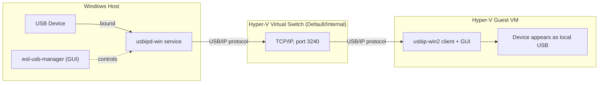

# Hyper-V USB device passthrough via USB/IP

Hyper-V has no built-in way to hand a USB device straight through to a VM the way VMware
Workstation or VirtualBox do. This guide explains why, why the "official" workaround (Enhanced
Session Mode) usually doesn't help, and how to get real USB passthrough working using USB/IP.

## Why native USB passthrough doesn't work

Hyper-V's virtualization model doesn't expose the host's USB controllers or individual USB devices
to a guest — there's no "attach this USB device to this VM" option like in VMware or VirtualBox:

- Generation 2 VMs have no virtual USB controller Hyper-V can map a physical device onto.
- Microsoft's supported passthrough path is limited to **DDA (Discrete Device Assignment)**, which
  only works for whole PCIe devices on Windows Server/Datacenter SKUs — not USB devices on a
  normal desktop Hyper-V host.
- There's no equivalent of VirtualBox's USB controller emulation or VMware's "connect to a VM" USB
  menu.

If the device doesn't live on a PCIe bus you can dedicate entirely to the VM, Hyper-V simply has no
mechanism to pass it through.

## The "official" workaround: Enhanced Session Mode

Hyper-V supports redirecting some host resources into a VM via **Enhanced Session Mode**, which
works over an RDP connection to the VM (Hyper-V Manager just embeds an RDP session instead of the
usual VMConnect console). This can redirect local drives, clipboard, printers, and plug-and-play
devices — but only a narrow set: **smart cards and a handful of standard PnP device classes**.

Most USB devices people actually want to pass through — dongles, HID devices with vendor drivers,
serial/CDC devices, security keys outside the smart-card class, capture devices, etc. — are **not**
redirected by Enhanced Session Mode. This is where most people get stuck: the mode is enabled, the
VM boots fine, but the device never shows up inside the guest.

## The solution: USB/IP

[**usbipd-win**](https://github.com/dorssel/usbipd-win) implements the USB/IP protocol on Windows.
It lets a Windows host share any USB device over a network connection so a client (Linux, WSL2, or
another Windows machine) can attach it as if locally connected. Since a Hyper-V VM talks to its
host over the network anyway (via the Default Switch or an internal/private switch), this sidesteps
Hyper-V's lack of passthrough entirely — the device is shared over IP, not over a virtual PCI/USB
bus.

Two front-ends make this practical without living in the terminal:

- **[wsl-usb-manager](https://github.com/nickbeth/wsl-usb-manager)** — a management GUI for
  `usbipd-win` on the **host**. Despite the WSL-focused name, it's a GUI over `usbipd`'s
  bind/attach/list operations and works for any USB/IP client, including a Hyper-V VM.
- **[usbip-win2](https://github.com/vadimgrn/usbip-win2)** — a Windows **client** with its own GUI,
  installed inside the guest VM, used to attach to devices shared by a usbipd-win host. This is the
  piece that makes host↔Hyper-V passthrough possible, since the stock `usbip` client tooling is
  Linux/WSL-oriented.



The device stays physically attached to the host. `usbipd-win` intercepts it at the driver level
and "binds" it, detaching it from normal Windows use and making it available for sharing. The
guest's `usbip-win2` client connects to the host's usbipd service over TCP (default port **3240**)
across the Hyper-V virtual switch, requests the device, and installs a virtual USB device inside
the guest that behaves like a locally attached one to any application or driver there.

## Prerequisites

- A Hyper-V host and guest VM.
- Administrator access on both.

## Steps

### 1. Install both tools via winget

On the **host**:

```powershell
winget install dorssel.usbipd-win
winget install nickbeth.wsl-usb-manager
```

On the **guest VM**:

```powershell
winget install vadimgrn.usbip-win2
```

> After installing `usbipd-win`, reboot the host once so its filter driver attaches correctly to
> existing USB devices.

### 2. Open the firewall on the host

`usbipd-win` listens on **TCP 3240**. The guest reaches the host through the Hyper-V virtual
switch, so a firewall rule needs to allow that traffic — the profile that applies depends on the
switch type:

- **Default Switch / external switch**: traffic from the VM typically shows up on the "Private" or
  "Domain" profile depending on network detection — check `Get-NetConnectionProfile` and adjust.
- **Internal switch** (recommended for a dedicated host↔VM link): create a rule scoped to that
  switch's subnet.

```powershell
New-NetFirewallRule -DisplayName "usbipd-win (USB/IP)" `
    -Direction Inbound -Protocol TCP -LocalPort 3240 `
    -Action Allow -Profile Any
```

Scope this further with `-RemoteAddress <vm-subnet>` if you don't want the port open to every
network the host is on.

### 3. Share the device from the host

Either the CLI or the GUI works.

**CLI (`usbipd`):**

```powershell
# List all USB devices and their bus IDs
usbipd list

# Bind (share) a device by its bus ID
usbipd bind --busid <busid>
```

For a Hyper-V VM (not WSL2), `bind` is all that's needed on the host side — the actual "attach"
happens from the guest using `usbip-win2`, not `usbipd attach`.

**GUI (`wsl-usb-manager`):** open it, select the device, click **Bind**/**Share**.

### 4. Attach the device from the guest VM

Inside the Hyper-V guest, open **usbip-win2**, enter the host's IP address (its address on the
switch the VM is connected to), and select the shared device to attach it. Once attached, it
enumerates in the guest exactly like a physically connected USB device.

## Verify

Check Device Manager inside the guest — the device should appear as local hardware, with drivers
loadable exactly as if it were physically attached.

## Troubleshooting

- **Device never shows up despite Enhanced Session Mode being enabled:** that mode only redirects
  smart cards and a narrow PnP class list — it silently does nothing for most other USB device
  classes. Use USB/IP instead.
- **Guest can't reach the host on port 3240:** check the firewall profile that actually applies to
  traffic from the Hyper-V switch (`Get-NetConnectionProfile`), not just the profile you assumed.
- **Need to use the device on the host again:** unbind it in `usbipd`/`wsl-usb-manager` first — it
  is exclusively owned by whichever side currently has it bound/attached.

## Related

<None yet.>

## Sources

- [Legacy wiki.js: Hyper-V USB Passthrough via USB/IP](../../../../../sources/administration/windows/2026-09-28-hyperv-usb-and-edge-tips.md) — private source
