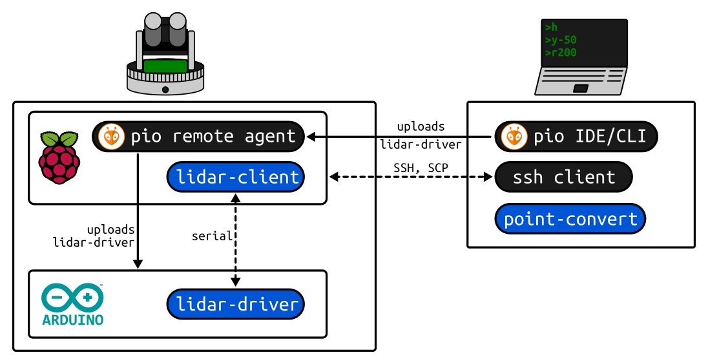

# PlatformIO Remote Agent setup

PlatformIO's Remote Agent lets you run PlatformIO commands against boards attached to another
computer — for example a Raspberry Pi — without being physically present at it. Flashing a
microcontroller through a Pi is often more reliable than flashing it directly from a PC, and it
means the controller never needs to be connected to the PC itself.



## Prerequisites

- A Raspberry Pi running Raspberry Pi OS **32-bit**.
- A PC with the PlatformIO Core CLI (or IDE) installed.

## Steps

### 1. Update the Raspberry Pi

```shell
sudo apt-get update && sudo apt-get upgrade -y && sudo apt-get dist-upgrade && sudo apt-get autoremove -y
```

### 2. Install required packages

```shell
sudo apt install python3 python3-pip libffi-dev libssl-dev -y
```

### 3. Install PlatformIO and the Remote Agent

> Do **not** run this as root — otherwise the resulting service won't be able to compile
> afterwards.

```shell
sudo pip3 install platformio
pio remote agent
pio account login
```

### 4. Create a systemd service for the agent

```shell
sudo nano /etc/systemd/system/pio-remote.service
```

```ini
[Unit]
Description=pio remote agent
Requires=network-online.target
After=network-online.target

[Service]
Type=simple
User=<user>
WorkingDirectory=/home/<user>
ExecStart=/usr/local/bin/platformio remote agent start
Restart=always

[Install]
WantedBy=multi-user.target
```

### 5. Enable and start the service

```shell
sudo systemctl enable pio-remote
sudo systemctl start pio-remote
```

## Verify

```shell
systemctl status pio-remote
```

If something goes wrong, check the agent's own log:

```shell
journalctl -e -t platformio
```

From the PC, `pio remote agent list` (after `pio account login` with the same account) should show
the Pi as an available remote agent, and `pio remote run` / `pio remote device monitor` should
reach boards attached to it.

## Troubleshooting

- **Compilation fails on the Pi after installing as root:** reinstall PlatformIO as a normal user —
  the remote agent service needs to compile under that user's environment.

## Related

- [community.platformio.org: Raspberry Pi 3 as a remote agent](https://community.platformio.org/t/howto-raspberry-pi-3-as-remote-agent-oct-2020/16700)
