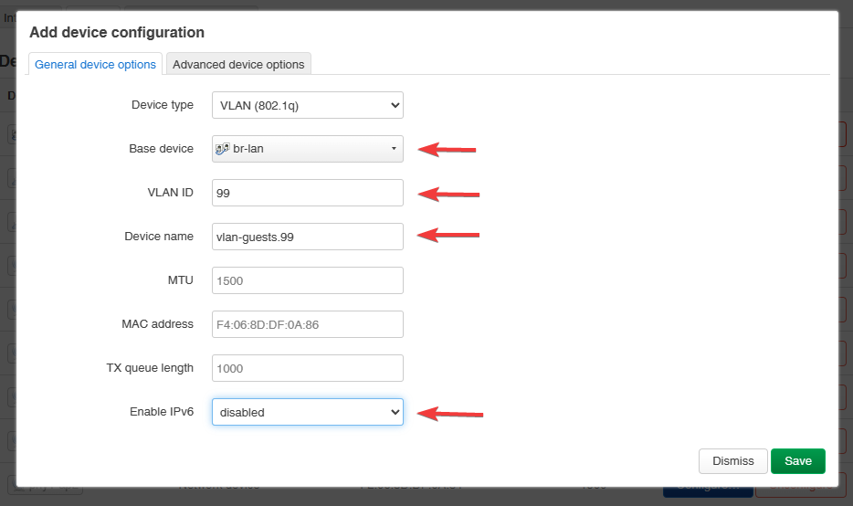
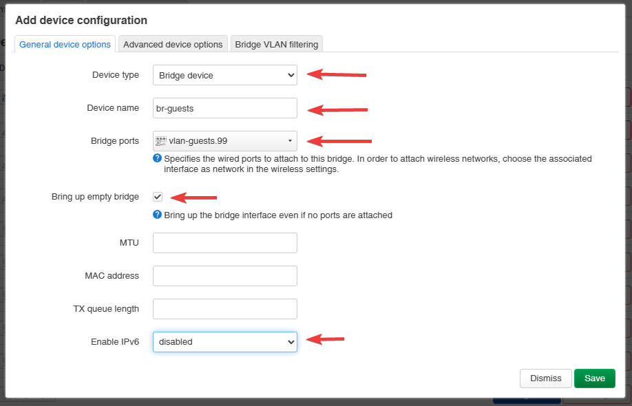
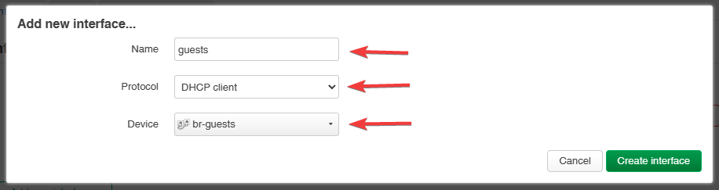
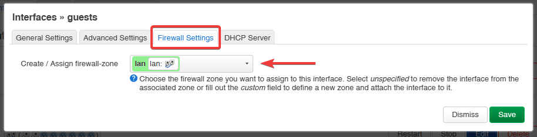

# Isolating a VLAN for guest Wi-Fi access on OpenWrt via LuCI

Give a guest (or any other) Wi-Fi SSID its own Layer-2-isolated VLAN on an OpenWrt device, entirely
through the LuCI web UI — no SSH or manual UCI editing needed. Useful when a router/switch fabric
already carries a tagged VLAN upstream (e.g. a firewall trunking a guest VLAN to the switch) and an
OpenWrt AP or router needs to terminate that VLAN and hand it to a wireless network.

## Prerequisites

- The VLAN must already exist upstream — i.e. it is configured on the switch (802.1Q trunking to
  this device's uplink port) and/or on the router/firewall that will route and DHCP it. This guide
  only covers the OpenWrt/LuCI side of terminating an existing VLAN, not creating it network-wide.
- The switch port feeding this device must pass the VLAN tag through (a trunk port, not access-only).

## Steps

### 1. Create the VLAN device

Go to **Network → Interfaces → Devices** → **Add new device** → select **VLAN Interface 802.1q**:

- **Name of the new interface**: a descriptive name, e.g. `vlan-guest99`
- **Base device**: `br-lan` (the bridge the VLAN is carried on)
- **VLAN ID**: the VLAN's numeric ID, e.g. `99`
- Optionally disable **Enable IPv6-Configuration** if IPv6 is not wanted on this network
- Click **Save**

### 2. Create a bridge for the VLAN

Go to **Network → Interfaces → Devices** → **Add new device** → select **Bridge device**:

- **Name of the new interface**: e.g. `br-guests`
- **Bridge ports**: the VLAN device created in step 1 (e.g. `vlan-guest99`)
- Optionally enable **Bring up empty bridge** (keeps the bridge up even with no active ports)
- Optionally disable **Enable IPv6-Configuration**

### 3. Create the logical interface

Go to **Network → Interfaces → Interfaces** → **Add new interface**:

- **Name of the new interface**: e.g. `guests`
- **Protocol of the new interface**: `DHCP client` (assuming the upstream router/firewall serves
  DHCP for this VLAN; use a static protocol instead if this device itself should route/serve it)
- **Device**: the bridge created in step 2 (e.g. `br-guests`)

After saving, assign a firewall zone to the new interface — the simplest starting point is to
reuse the existing `lan` zone's settings and adjust from there (e.g. add explicit isolation rules
if the goal is a fully isolated guest network, not just a separate broadcast domain):

### 4. Assign the interface to a wireless network

Go to **Network → Wireless**, click **Edit** on the SSID that should use this VLAN, and under the
**Network** setting select the new interface (`guests`) created in step 3.

## Verify

- Connect a client to the target SSID and confirm it receives an address from the expected
  (guest) DHCP pool rather than the main LAN's.
- Confirm the client cannot reach hosts on the main LAN if isolation is the goal — the bridge and
  firewall-zone setup alone gives a separate broadcast domain, not automatic client isolation;
  add explicit firewall rules (e.g. deny the guest zone → lan zone forwarding) if true isolation is
  required.

## Troubleshooting

- **Client gets no IP / wrong subnet**: check that the switch port between this device and the
  upstream router actually tags the VLAN (trunk, not access port), and that the VLAN ID in step 1
  matches the upstream configuration exactly.
- **New SSID doesn't come up on the interface**: re-check step 4 — the wireless interface's
  `network` option must reference the exact interface name created in step 3, not the bridge or
  VLAN device names from steps 1–2.

## Related

<None yet.>

## Sources

- [Legacy wiki.js: OpenWrt VLAN client configuration](../../../../../sources/network/access-points/2026-09-28-openwrt-vlan-guest-network.md)
